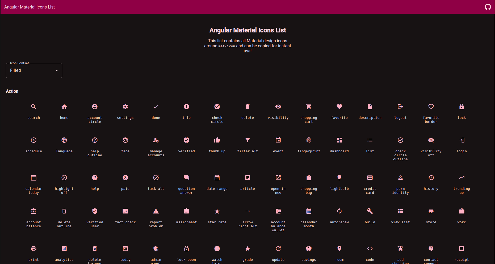

# Angular Material Icon List

This project contains the list of icons from the [Material icons](https://fonts.google.com/icons) but with ability to copy the icon as Angular Material Icon `<mat-icon>` directly as the offical site makes it a bit difficult without the `<mat-icon>` tag or the link URL for other fontsets.

# Preview

[https://naaajii.github.io/angular-material-icon-list/](https://naaajii.github.io/angular-material-icon-list/)

# Contributing

Free feel to send in PRs with enhancing new things to this site, you can check [nice to have](#nice-to-have) features which I originally had plans to add but didn't.

# Nice to have

1. Search all icons input field
2. Icons shown according to selected category
3. Being able to change icons color
4. Allow user to add custom html attributes such as `class` from input field & when icons are copied it copies it as whole.